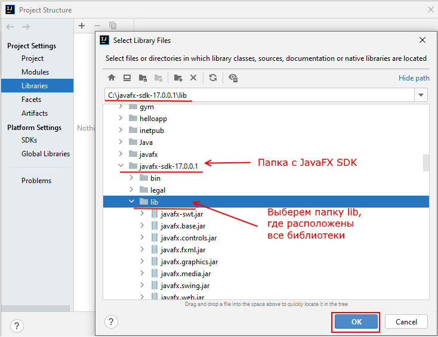

# Sea_Battle
Учебный проект "Морской бой" по предмету Платформонезависимое программирование. Разработан студентами группы ПРИ-220: Ворчалов И.Д., Круглов А.А., Гурьева А.В.
 
 
Для корректного запуска проекта нужно выполнить следующие шаги:
 
 
1. Чтобы запустить проект, нам надо подключить библиотеки JavaFX. Для этого перейдем в меню File->Project Structure:
 

 
 
2. В открывшемся окне перейдем к пункту Libraries:

 
 
3. В этой вкладке нажмем на знак + и в появившемся небольшом окошке выберем Java.
 
Далее в открывшемся диалоговом окне выберем путь к каталоге lib в папке, где распакован JavaFX SDK. И нажмем на OK для подключения библиотек.
 

 
 
4. И далее нажмем на кнопку Apply для применения изменений и затем на кнопку OK.
 

 
 
5. Далее перейдем в меню Run -> Edit Configuration
 

 
 
6. И в открывшемся окне перейдем к полю VM options. Если это поле отстутствует, то нажмем на опцию Modify options и в контекстном меню выберем Add VM options
 

 
 
`--module-path "путь к JavFX SDK\lib" --add-modules javafx.controls,javafx.fxml`
 
 

